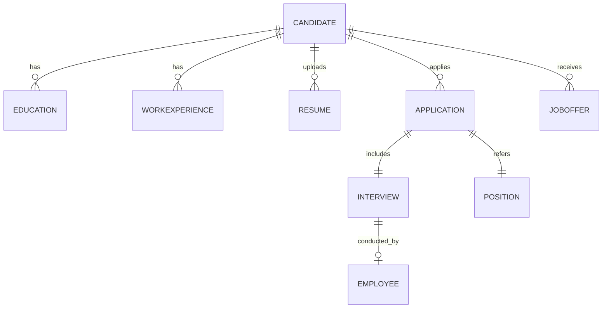

### **1. Introducción**

----------

#### **1.1 Propósito del Documento**

El propósito de este documento es integrar el modelo ERD propuesto con el modelo Prisma existente, asegurando una transición fluida que mantenga la coherencia y escalabilidad del sistema. Este documento describe los cambios necesarios para implementar nuevas funcionalidades y mejorar la eficiencia del flujo de contratación, abarcando aplicaciones, entrevistas, ofertas laborales y auditoría de datos.

----------

#### **1.2 Alcance del Modelo de Base de Datos**

El modelo actualizado expande la funcionalidad del sistema Prisma actual para incluir:

-   **Gestión de Aplicaciones (`Application`)**: Relacionar candidatos con posiciones abiertas.
-   **Seguimiento de Entrevistas (`Interview`)**: Registrar, programar y evaluar entrevistas.
-   **Ofertas Laborales (`JobOffer`)**: Formalizar las ofertas realizadas a los candidatos.
-   **Auditoría de Datos**: Incorporar campos para rastrear la creación y actualización de registros.

Esta extensión garantiza una estructura sólida para manejar procesos de contratación complejos, con un enfoque en la escalabilidad y mantenibilidad.

----------

#### **1.3 Contexto Inicial**

El modelo Prisma actual incluye las siguientes entidades:

-   **`Candidate`**: Representa a los postulantes.
-   **`Education` y `WorkExperience`**: Detallan la formación académica y experiencia laboral del candidato.
-   **`Resume`**: Almacena los archivos subidos por el candidato.

El modelo propuesto introduce nuevas entidades y relaciones, manteniendo la compatibilidad con los elementos existentes y optimizando el flujo de datos.

----------

#### **Anotaciones**

-   **Compatibilidad hacia atrás**: Se garantiza que los cambios no interfieran con funcionalidades actuales.
-   **Escalabilidad**: El diseño asegura que el modelo puede expandirse fácilmente para futuros requerimientos.

----------

#### **Diagrama General del Modelo Actual y Propuesto**



----------

### **2. Descripción del Modelo Actual**

----------

#### **2.1 Diagrama ERD**

A continuación, se presenta el diagrama ERD actualizado que refleja las entidades existentes y las nuevas introducidas en el modelo propuesto:


----------

#### **2.2 Análisis General del Modelo**

El modelo Prisma actualizado está diseñado para gestionar el flujo completo de contratación, desde la postulación del candidato hasta la oferta laboral final. Las relaciones clave incluyen:

1.  **Relaciones del Candidato (`Candidate`)**:
    
    -   Asociado a múltiples elementos como `Education`, `WorkExperience` y `Resume` para construir un perfil completo.
    -   Relacionado con `Application` para vincular al candidato con posiciones abiertas.
2.  **Entidades Nuevas**:
    
    -   **`Application`**: Vínculo entre `Candidate` y `Position`, que registra las aplicaciones enviadas.
    -   **`Interview`**: Registra entrevistas asociadas a aplicaciones.
    -   **`JobOffer`**: Formaliza ofertas laborales realizadas a los candidatos.

----------

#### **2.3 Descripción de las Entidades**

##### **2.3.7 Candidate**

**Propósito**: Representar a los postulantes al sistema.

**Atributos**:

-   `id`: Identificador único.
-   `first_name` y `last_name`: Nombre y apellido del candidato.
-   `email`: Correo electrónico único.
-   `status`: Indica si el candidato está activo o inactivo.
-   `created_at`, `updated_at`: Campos para auditoría.

```prisma
model Candidate {
    id          Int       @id @default(autoincrement())
    first_name  String    @db.VarChar(100)
    last_name   String    @db.VarChar(100)
    email       String    @unique @db.VarChar(255)
    phone       String?   @db.VarChar(15)
    address     String?   @db.VarChar(100)
    status      String    @default("active")
    created_at  DateTime  @default(now())
    updated_at  DateTime  @updatedAt
    educations  Education[]
    workExperiences WorkExperience[]
    resumes     Resume[]
    applications Application[]
}

```

----------

##### **2.3.8 Application (Nueva Entidad)**

**Propósito**: Representar aplicaciones enviadas por los candidatos.

**Atributos**:

-   `id`: Identificador único.
-   `status`: Estado de la aplicación (e.g., pendiente, aceptada, rechazada).
-   `applied_at`: Fecha de envío de la aplicación.
-   Relación directa con `Candidate` y `Position`.

```prisma
model Application {
    id          Int       @id @default(autoincrement())
    positionId  Int
    candidateId Int
    status      String    @default("pending")
    applied_at  DateTime  @default(now())
    created_at  DateTime  @default(now())
    updated_at  DateTime  @updatedAt
    candidate   Candidate @relation(fields: [candidateId], references: [id])
    position    Position  @relation(fields: [positionId], references: [id])
    interviews  Interview[]
}

```

----------

##### **2.3.9 Interview (Nueva Entidad)**

**Propósito**: Registrar entrevistas realizadas como parte del proceso de selección.

**Atributos**:

-   `id`: Identificador único.
-   `scheduled_at`: Fecha programada para la entrevista.
-   `result`: Resultado de la entrevista.
-   Relación con `Application` y `Employee`.

```prisma
model Interview {
    id            Int       @id @default(autoincrement())
    applicationId Int
    scheduled_at  DateTime
    result        String?   @db.VarChar(100)
    notes         String?   @db.VarChar(500)
    conducted_by  Employee? @relation(fields: [conducted_by_id], references: [id])
    conducted_by_id Int?
    application   Application @relation(fields: [applicationId], references: [id])
}

```

----------

##### **2.3.10 Education**

**Propósito**: Registrar la formación académica del candidato.

**Atributos**:

-   `id`: Identificador único.
-   `educationLevel`: Nivel de estudios alcanzado.

```prisma
model Education {
    id            Int       @id @default(autoincrement())
    institution   String    @db.VarChar(100)
    title         String    @db.VarChar(250)
    startDate     DateTime
    endDate       DateTime?
    educationLevel String?   @db.VarChar(50)
    candidateId   Int
    candidate     Candidate @relation(fields: [candidateId], references: [id])
}

```

----------

##### **2.3.11 WorkExperience**

**Propósito**: Detallar la experiencia laboral del candidato.

**Atributos**:

-   `id`: Identificador único.
-   `achievements`: Logros destacados en el rol.

```prisma
model WorkExperience {
    id          Int       @id @default(autoincrement())
    company     String    @db.VarChar(100)
    position    String    @db.VarChar(100)
    description String?   @db.VarChar(200)
    achievements String?  @db.VarChar(500)
    startDate   DateTime
    endDate     DateTime?
    candidateId Int
    candidate   Candidate @relation(fields: [candidateId], references: [id])
}

```

----------

##### **2.3.12 JobOffer (Nueva Entidad)**

**Propósito**: Formalizar ofertas realizadas a los candidatos.

**Atributos**:

-   `id`: Identificador único.
-   `status`: Estado de la oferta (e.g., pendiente, aceptada, rechazada).
-   `offered_at`: Fecha de creación de la oferta.

```prisma
model JobOffer {
    id            Int       @id @default(autoincrement())
    candidateId   Int
    positionId    Int
    offered_at    DateTime  @default(now())
    status        String    @default("pending")
    candidate     Candidate @relation(fields: [candidateId], references: [id])
    position      Position  @relation(fields: [positionId], references: [id])
}

```

----------

### **3. Análisis de Mejoras**

----------

#### **3.1 Normalización**

El modelo actualizado cumple con las reglas de normalización hasta la tercera forma normal (3FN), garantizando la integridad y eliminación de redundancias:

-   **Entidades Nuevas:**
    
    -   `Application`: Normaliza la relación entre `Candidate` y `Position`.
    -   `Interview`: Asegura que los datos de entrevistas no se dupliquen y están vinculados de manera clara a aplicaciones específicas.
-   **Ajustes Realizados:**
    
    -   Separación de atributos extensos o redundantes como `achievements` en `WorkExperience`.
    -   Inclusión de `educationLevel` en `Education` para evitar registros repetitivos.

----------

#### **3.2 Índices Propuestos**

Los índices optimizan las consultas más frecuentes del sistema:

1.  **Índice Compuesto para `Application`:**
    
    -   Mejora la eficiencia al filtrar aplicaciones por estado y posición.
    -   **SQL Propuesto**:
        
        ```sql
        CREATE INDEX idx_application_status_position
        ON Application (status, positionId);
        
        ```
        
2.  **Índice para `Interview`:**
    
    -   Optimiza la búsqueda de entrevistas programadas.
    -   **SQL Propuesto**:
        
        ```sql
        CREATE INDEX idx_interview_scheduled
        ON Interview (scheduled_at);
        
        ```
        

----------

#### **3.3 Relaciones y Claves Foráneas**

1.  **Relación `Candidate - Application`:**
    
    -   Garantiza que cada aplicación esté vinculada a un candidato válido.
    -   **Restricción**:
        
        ```sql
        ALTER TABLE Application
        ADD CONSTRAINT fk_application_candidate FOREIGN KEY (candidateId) REFERENCES Candidate (id) ON DELETE CASCADE;
        
        ```
        
2.  **Relación `Application - Interview`:**
    
    -   Asegura que las entrevistas correspondan a aplicaciones válidas.
    -   **Restricción**:
        
        ```sql
        ALTER TABLE Interview
        ADD CONSTRAINT fk_interview_application FOREIGN KEY (applicationId) REFERENCES Application (id) ON DELETE CASCADE;
        
        ```
        
3.  **Relación `Candidate - JobOffer`:**
    
    -   Evita inconsistencias al relacionar candidatos con ofertas.
    -   **Restricción**:
        
        ```sql
        ALTER TABLE JobOffer
        ADD CONSTRAINT fk_joboffer_candidate FOREIGN KEY (candidateId) REFERENCES Candidate (id) ON DELETE CASCADE;
        
        ```
        

----------

#### **3.4 Integridad Referencial**

Para reforzar la integridad del modelo:

1.  **Auditoría Automática:**
    
    -   **Estrategia**: Utilizar campos como `created_at` y `updated_at` para rastrear cambios en tablas clave.
    -   **Ejemplo de Prisma**:
        
        ```prisma
        model Application {
            created_at  DateTime  @default(now())
            updated_at  DateTime  @updatedAt
        }
        
        ```
        
2.  **Eliminación en Cascada (`ON DELETE CASCADE`):**
    
    -   Asegura que los datos relacionados se eliminen automáticamente cuando se elimina un registro principal.
    -   Aplicado en relaciones críticas como:
        -   `Candidate - Application`
        -   `Application - Interview`

----------

### **Anotaciones**

-   **Decisión Clave**: La normalización priorizó la eliminación de redundancias y la claridad de relaciones.
-   **Riesgos Mitigados**:
    -   **Conflictos de integridad**: Las claves foráneas aseguran relaciones válidas.
    -   **Duplicidad**: Los índices propuestos optimizan consultas frecuentes y evitan datos redundantes.

----------

### **4. Optimización del Rendimiento**

----------

#### **4.1 Índices Compuestos y Estrategias Avanzadas**

Los índices compuestos propuestos están diseñados para optimizar las consultas más frecuentes en el sistema, asegurando un acceso eficiente a los datos.

##### **1. Índice para `Application`**

-   **Propósito**: Mejorar la eficiencia al filtrar aplicaciones por estado y posición.
-   **SQL Propuesto**:
    
    ```sql
    CREATE INDEX idx_application_status_position
    ON Application (status, positionId);
    
    ```
    
-   **Impacto**:
    -   Optimiza reportes sobre el estado de las aplicaciones.
    -   Acelera búsquedas relacionadas con posiciones específicas.

##### **2. Índice para `Interview`**

-   **Propósito**: Optimizar búsquedas de entrevistas programadas.
-   **SQL Propuesto**:
    
    ```sql
    CREATE INDEX idx_interview_scheduled
    ON Interview (scheduled_at);
    
    ```
    
-   **Impacto**:
    -   Reduce los tiempos de respuesta en consultas que ordenan entrevistas por fechas.

##### **3. Índice para `Candidate`**

-   **Propósito**: Acelerar búsquedas por correo electrónico, que suelen ser únicas y frecuentes.
-   **SQL Propuesto**:
    
    ```sql
    CREATE INDEX idx_candidate_email
    ON Candidate (email);
    
    ```
    

----------

#### **4.2 Diseño para Escalabilidad**

##### **1. Particionamiento de Tablas**

Para tablas con alto volumen de datos, como `Application` e `Interview`, se recomienda implementar particionamiento basado en fechas.

-   **Estrategia**: Particionar por rango de fechas (e.g., año o trimestre).
-   **Ejemplo en `Application`**:
    
    ```sql
    CREATE TABLE Application_2024 (
        id SERIAL PRIMARY KEY,
        positionId INT,
        candidateId INT,
        status VARCHAR(50),
        applied_at DATE NOT NULL,
        created_at TIMESTAMP DEFAULT NOW(),
        updated_at TIMESTAMP DEFAULT NOW()
    ) PARTITION BY RANGE (applied_at);
    
    ```
    

##### **2. Vistas Materializadas**

Para consultas complejas y frecuentes (e.g., reportes), se recomienda usar vistas materializadas.

-   **Ejemplo para aplicaciones por posición**:
    
    ```sql
    CREATE MATERIALIZED VIEW mv_application_summary AS
    SELECT positionId, status, COUNT(*) AS total_applications
    FROM Application
    GROUP BY positionId, status;
    
    ```
    
-   **Beneficio**:
    -   Reduce el tiempo de procesamiento al precomputar datos.

----------

#### **4.3 Reducción de Complejidad en Consultas**

##### **1. Denormalización Estratégica**

En casos donde se realicen consultas frecuentes con múltiples uniones, se recomienda denormalizar datos en tablas específicas:

-   **Ejemplo**: Agregar un conteo de aplicaciones en `Position`:
    
    ```prisma
    model Position {
        id                Int       @id @default(autoincrement())
        title             String    @db.VarChar(100)
        application_count Int       @default(0) // Campo denormalizado
    }
    
    ```
    

##### **2. Caché de Consultas**

Para reportes complejos que no cambian frecuentemente, implementar un sistema de caché a nivel de aplicación (e.g., utilizando Redis).

----------

#### **Anotaciones**

-   **Balance entre normalización y rendimiento**:
    -   Las estrategias como vistas materializadas y campos denormalizados son opcionales y se aplican según los casos de uso.
-   **Escalabilidad garantizada**:
    -   El particionamiento y los índices aseguran que el modelo pueda manejar grandes volúmenes de datos.

----------

### **5. Casos de Uso y Ejemplos Prácticos**

----------

#### **5.1 Consultas Frecuentes**

##### **Caso 1: Búsqueda de Posiciones Abiertas en una Ubicación Específica**

-   **Descripción**: Recuperar todas las posiciones abiertas en una ubicación específica con un salario mínimo superior a un umbral.
-   **Consulta SQL**:
    
    ```sql
    SELECT id, title, location, salary_min, salary_max 
    FROM Position
    WHERE status = 'open' AND location = 'Remote' AND salary_min > 50000;
    
    ```
    

----------

##### **Caso 2: Seguimiento de Aplicaciones Activas de un Candidato**

-   **Descripción**: Consultar todas las aplicaciones activas de un candidato específico por correo electrónico.
-   **Consulta SQL**:
    
    ```sql
    SELECT a.id, p.title, a.status, a.applied_at 
    FROM Application a
    JOIN Candidate c ON a.candidateId = c.id
    JOIN Position p ON a.positionId = p.id
    WHERE c.email = 'candidate@example.com' AND a.status = 'active';
    
    ```
    

----------

##### **Caso 3: Listado de Entrevistas Programadas para un Día**

-   **Descripción**: Listar todas las entrevistas programadas para una fecha específica.
-   **Consulta SQL**:
    
    ```sql
    SELECT i.id, c.first_name, c.last_name, p.title, i.scheduled_at 
    FROM Interview i
    JOIN Application a ON i.applicationId = a.id
    JOIN Candidate c ON a.candidateId = c.id
    JOIN Position p ON a.positionId = p.id
    WHERE i.scheduled_at::DATE = '2024-12-10';
    
    ```
    

----------

#### **5.2 Reprogramación de Entrevistas**

##### **Caso 4: Reprogramar una Entrevista Existente**

-   **Descripción**: Cambiar la fecha de una entrevista y agregar una nota.
-   **Consulta SQL**:
    
    ```sql
    UPDATE Interview
    SET scheduled_at = '2024-12-15 14:00', notes = 'Reprogramada por solicitud del candidato'
    WHERE id = 123;
    
    ```
    

----------

#### **5.3 Generación de Reportes**

##### **Caso 5: Número de Aplicaciones por Estado y Posición**

-   **Descripción**: Generar un reporte con el total de aplicaciones agrupadas por estado y posición.
-   **Consulta SQL**:
    
    ```sql
    SELECT p.title, a.status, COUNT(*) AS total_applications
    FROM Application a
    JOIN Position p ON a.positionId = p.id
    GROUP BY p.title, a.status
    ORDER BY p.title, a.status;
    
    ```
    

----------

##### **Caso 6: Promedio de Puntuaciones por Tipo de Entrevista**

-   **Descripción**: Calcular el promedio de puntuaciones asignadas a los candidatos en entrevistas exitosas.
-   **Consulta SQL**:
    
    ```sql
    SELECT t.name AS interview_type, AVG(i.score) AS avg_score
    FROM Interview i
    JOIN InterviewStep s ON i.stepId = s.id
    JOIN InterviewType t ON s.typeId = t.id
    WHERE i.result = 'pass'
    GROUP BY t.name
    ORDER BY avg_score DESC;
    
    ```
    

----------

#### **Anotaciones**

-   **Consultas Optimizadas**:
    -   Aprovechan los índices compuestos propuestos para mejorar tiempos de respuesta.
-   **Aplicaciones Prácticas**:
    -   Las consultas permiten gestionar eficientemente los datos en casos reales como filtrado de candidatos, reprogramación de entrevistas y reportes analíticos.

----------

### **6. Propuestas de Cambios**

----------

#### **6.1 Renombramiento de Columnas y Relaciones**

##### **Propósito**

Establecer consistencia en la nomenclatura de columnas y relaciones para mejorar la claridad y mantenibilidad del modelo.

##### **Propuesta de Cambios**

-   Usar `snake_case` para todos los nombres de columnas.
-   Ejemplo para la entidad `Candidate`:
    
    ```prisma
    model Candidate {
        id          Int       @id @default(autoincrement())
        first_name  String    @db.VarChar(100)
        last_name   String    @db.VarChar(100)
        email       String    @unique @db.VarChar(255)
        phone       String?   @db.VarChar(15)
        address     String?   @db.VarChar(100)
        status      String    @default("active")
        created_at  DateTime  @default(now())
        updated_at  DateTime  @updatedAt
    }
    
    ```
    

##### **Impacto**

-   Claridad en la documentación y el uso del modelo.
-   Compatibilidad con estándares comunes de bases de datos.

----------

#### **6.2 Ajustes en las Relaciones entre Entidades**

##### **Relación `Application - Candidate`**

-   Garantizar integridad referencial mediante claves foráneas con eliminación en cascada.
-   **SQL Propuesto**:
    
    ```sql
    ALTER TABLE Application
    ADD CONSTRAINT fk_application_candidate
    FOREIGN KEY (candidateId) REFERENCES Candidate (id)
    ON DELETE CASCADE;
    
    ```
    

##### **Relación `Interview - Application`**

-   Asegurar que cada entrevista esté vinculada a una aplicación válida.
-   **SQL Propuesto**:
    
    ```sql
    ALTER TABLE Interview
    ADD CONSTRAINT fk_interview_application
    FOREIGN KEY (applicationId) REFERENCES Application (id)
    ON DELETE CASCADE;
    
    ```
    

##### **Relación `JobOffer - Candidate`**

-   Garantizar que las ofertas se asignen a candidatos existentes.
-   **SQL Propuesto**:
    
    ```sql
    ALTER TABLE JobOffer
    ADD CONSTRAINT fk_joboffer_candidate
    FOREIGN KEY (candidateId) REFERENCES Candidate (id)
    ON DELETE CASCADE;
    
    ```
    

----------

#### **6.3 Denormalización Estratégica**

##### **Propósito**

Mejorar la eficiencia de consultas frecuentes mediante campos calculados o redundantes.

##### **Ejemplo**

-   Agregar un campo `application_count` en la entidad `Position` para agilizar reportes:
    
    ```prisma
    model Position {
        id                Int       @id @default(autoincrement())
        title             String    @db.VarChar(100)
        application_count Int       @default(0)
    }
    
    ```
    
-   **Trigger para Actualización Automática**:
    
    ```sql
    CREATE OR REPLACE FUNCTION update_application_count()
    RETURNS TRIGGER AS $$
    BEGIN
        UPDATE Position
        SET application_count = (
            SELECT COUNT(*) FROM Application WHERE positionId = NEW.positionId
        )
        WHERE id = NEW.positionId;
        RETURN NEW;
    END;
    $$ LANGUAGE plpgsql;
    
    CREATE TRIGGER trigger_application_count
    AFTER INSERT OR DELETE ON Application
    FOR EACH ROW EXECUTE FUNCTION update_application_count();
    
    ```
    

----------

#### **6.4 Agregación de Nuevas Entidades o Atributos**

##### **Entidad `JobOffer`**

-   **Propósito**: Formalizar ofertas realizadas a los candidatos después de las entrevistas.
-   **Modelo Prisma**:
    
    ```prisma
    model JobOffer {
        id            Int       @id @default(autoincrement())
        candidateId   Int
        positionId    Int
        offered_at    DateTime  @default(now())
        status        String    @default("pending")
        candidate     Candidate @relation(fields: [candidateId], references: [id])
        position      Position  @relation(fields: [positionId], references: [id])
    }
    
    ```
    

##### **Auditoría en Tablas Clave**

-   Agregar campos `created_at` y `updated_at` en tablas principales:
    
    ```prisma
    model Application {
        created_at  DateTime  @default(now())
        updated_at  DateTime  @updatedAt
    }
    
    ```
    

----------

#### **Anotaciones**

-   **Riesgos Mitigados**:
    -   Las claves foráneas eliminan la posibilidad de datos huérfanos.
    -   Los índices compuestos y campos denormalizados reducen la carga en consultas frecuentes.
-   **Flexibilidad**:
    -   La adición de la entidad `JobOffer` permite integrar formalizaciones en el proceso sin alterar el flujo existente.

----------

### **7. Conclusiones**

----------

#### **7.1 Beneficios Esperados de las Mejoras**

##### **1. Escalabilidad**

-   El modelo actualizado maneja de manera eficiente un mayor volumen de datos, incluyendo aplicaciones, entrevistas y ofertas laborales.
-   Las estrategias de particionamiento y vistas materializadas aseguran un rendimiento constante incluso con crecimiento exponencial de datos.

##### **2. Rendimiento**

-   Índices compuestos optimizan las consultas más frecuentes, reduciendo los tiempos de respuesta.
-   Denormalización estratégica en campos clave como `application_count` agiliza reportes y análisis sin comprometer la integridad de los datos.

##### **3. Mantenibilidad**

-   El uso de `snake_case` en la nomenclatura de columnas y relaciones facilita la comprensión y extensibilidad del modelo.
-   Las auditorías automáticas (`created_at`, `updated_at`) y las claves foráneas con eliminación en cascada aseguran la consistencia de los datos.

##### **4. Flexibilidad**

-   La adición de la entidad `JobOffer` permite integrar formalizaciones de ofertas laborales sin alterar el flujo existente.
-   Los campos como `status` en `Candidate` y `Application` proporcionan más control sobre el ciclo de vida de los procesos.

----------

#### **7.2 Impacto en el Sistema a Largo Plazo**

##### **1. Reducción de Errores**

-   La eliminación en cascada y las claves foráneas garantizan integridad referencial, minimizando datos huérfanos y errores de relaciones incorrectas.

##### **2. Mejora de Procesos de Negocio**

-   Las consultas optimizadas y la capacidad de generar reportes detallados permiten un análisis más profundo del desempeño del proceso de contratación.

##### **3. Alineación con Necesidades Futuras**

-   El modelo se diseñó teniendo en cuenta la posibilidad de integrarse con nuevas funcionalidades, como evaluaciones automáticas o integración con herramientas externas (e.g., plataformas de entrevistas en línea).

----------

#### **Anotaciones Finales**

-   **Preparación para Implementación**:
    -   El modelo actualizado está listo para implementación en el sistema Prisma, con un impacto mínimo en las funcionalidades existentes.
    -   Se recomienda validar las consultas y vistas materializadas con datos reales antes de implementar en producción.

----------