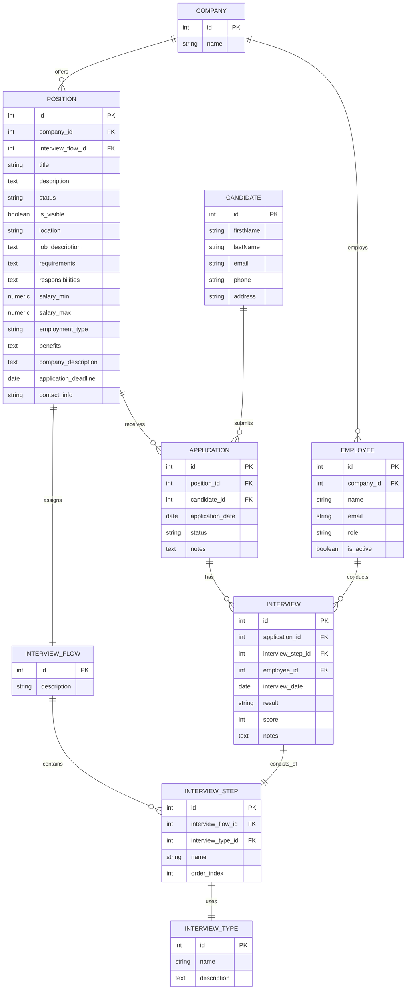
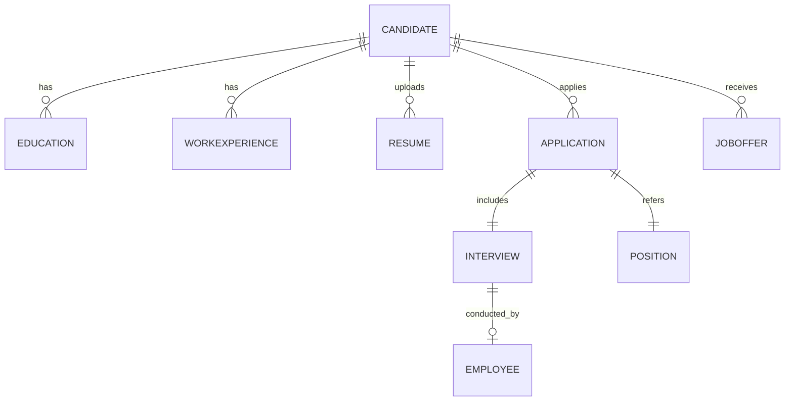

### **Transcripción de ChatGPT-4o **

Este documento fue elaborado con el apoyo de herramientas de inteligencia artificial basadas en el modelo ChatGPT-4o y Cursor usando el modelo Claude-3.5-Sonnet.

---

**Usuario:**  
A continuación, se presenta un ERD (Entity-Relationship Diagram) que contiene varias entidades y sus relaciones para una base de datos.

Tu Rol:

Tu rol principal será el de un experto en bases de datos, especializado en PostgreSQL. Analizarás y optimizarás el modelo proporcionado.

Instrucciones:

1. **Análisis General**:
   - Proporciona un resumen general de la estructura de la base de datos.
   - Explica cómo están conectadas las principales entidades y el propósito general del sistema.
   
2. **Análisis Detallado**:
   - Describe cada una de las entidades, incluyendo:
     - Sus atributos principales, claves primarias (PK) y foráneas (FK).
     - Su propósito en el modelo.
   - Detalla las relaciones entre las tablas:
     - Tipo de relación (uno a uno, uno a muchos, muchos a muchos).
     - Propósito de cada relación dentro del contexto del sistema.

3. **Identificación de Mejoras**:
   - Índices:
     - Identifica columnas que frecuentemente se utilizarían en condiciones de filtrado, búsquedas o uniones, y sugiere índices adecuados.
   - Normalización:
     - Evalúa si la base de datos sigue las buenas prácticas de normalización.
     - Si detectas redundancias o problemas de diseño, explica cómo podrían solucionarse.

4. **Optimización del Rendimiento**:
   - Proporciona recomendaciones para mejorar la eficiencia, como:
     - Estrategias de índice (por ejemplo, índices compuestos).
     - Reorganización de datos si es necesario.
     - Agregación o simplificación de relaciones complejas.

5. **Casos de Uso**:
   - Proporciona ejemplos prácticos de cómo las tablas y relaciones podrían utilizarse en consultas comunes.

6. **Cambios Sugeridos**:
   - Propón cambios concretos para mejorar el modelo, como:
     - Creación de índices en columnas frecuentemente utilizadas en condiciones de filtrado y uniones.
     - Ajustes en nombres de columnas o relaciones para mayor claridad.
     - Reorganización de tablas o relaciones para cumplir con buenas prácticas de diseño.

7. **Preguntas Previas**:
   - Antes de proceder con el análisis, plantea las preguntas necesarias para aclarar cualquier posible duda sobre el propósito del modelo o los requisitos esperados.

Modelo Actual:



Por favor, analiza la base de datos con base en las instrucciones proporcionadas y ofrece sugerencias claras y detalladas para mejorar su diseño y rendimiento. Si tienes preguntas iniciales o necesitas más contexto antes de comenzar, por favor plantea las preguntas necesarias antes de proceder.

---

**IA:**  
Respuestas:  
1. **Propósito General del Sistema:**  
   El sistema está diseñado para gestionar procesos de contratación en una sola empresa, al menos por ahora.  

2. **Volumen de Datos:**  
   Se espera manejar una gran cantidad de candidatos y posiciones, lo que implica la necesidad de diseñar una base de datos escalable, con índices adecuados y, posiblemente, particionamiento para optimizar consultas.  

3. **Casos de Uso Principales:**  
   - Consultas básicas (filtrar candidatos, buscar posiciones abiertas).  
   - Consultas avanzadas para reportes (análisis de candidatos, desempeño de procesos de selección, etc.).  
   - Reprogramación de entrevistas.  

4. **Relaciones Temporales:**  
   Las entrevistas pueden ser reprogramadas, lo que requiere un diseño flexible para manejar cambios en la programación sin afectar la integridad de los datos.  

5. **Seguridad y Permisos:**  
   Se necesitan permisos para los usuarios, lo que indica que será necesario implementar un control granular de acceso a datos, definiendo roles y permisos específicos.  

6. **Requisitos No Funcionales:**  
   No se especifican tiempos de respuesta ideales, pero debido al volumen esperado, sería recomendable priorizar consultas rápidas, especialmente para reportes y operaciones frecuentes.  

7. **Reglas de Negocio:**  
   Aunque no se mencionan reglas específicas, se puede asumir que podrían existir validaciones como:  
   - Correos únicos por candidato.  
   - Restricción para no programar entrevistas en fechas/horas que ya están ocupadas.  

8. **Compatibilidad con Otros Sistemas:**  
   No se menciona explícitamente la necesidad de integración con otros sistemas, aunque sería útil aclarar si se espera interactuar con plataformas de terceros, como servicios de agenda o sistemas de gestión de recursos humanos.  

Si necesitas un análisis más profundo o diagramas para apoyar este diseño, házmelo saber.  

---

**Usuario:**  
De acuerdo, vamos a proceder iterando punto por punto para garantizar una revisión detallada y aprobaciones claras. Antes de iniciar con la iteración, sigue los pasos detallados a continuación:

Pasos a Seguir:

1. **Generación de Índice Inicial:**
   - Lo primero que debes hacer es generar y mostrar el índice que tendrá el documento.
   - Asegúrate de que el índice sea estructurado y jerárquico, con títulos y subtítulos que reflejen claramente el contenido de cada sección.
   - Proporciona una vista previa del índice para su revisión y aprobación antes de proceder con el desarrollo del contenido.

2. **Creación del Documento Completo:**
   - Una vez aprobado el índice, genera el documento con la información actualmente disponible.
   - Asegúrate de incluir:
     - **Estructura Clara**: Encabezados jerárquicos, listas, tablas y diagramas según sea necesario.
     - **Contexto Completo**: Refleja todo lo discutido hasta ahora, sin omitir ningún detalle.
     - **Espacios para Revisión**: Deja notas o comentarios en las secciones donde puedan requerirse ajustes.

3. **Consideraciones para el Modelo Actual:**
   - En la sección de mejoras y cambios al modelo, incorpora los siguientes puntos:
     - **Normalización:**
       - Asegúrate de que las entidades sigan las formas normales para reducir redundancias y mejorar la integridad de los datos.
       - Identifica entidades o atributos redundantes y propone soluciones para eliminarlos.
     - **Escalabilidad:**
       - Diseña el modelo para manejar el crecimiento de los datos y las consultas sin afectar el rendimiento.
       - Sugiere la creación de índices en columnas frecuentemente utilizadas en queries para mejorar la eficiencia.
     - **Mantenibilidad:**
       - Asegúrate de que el esquema sea fácil de entender, modificar y extender según evolucionen los requisitos del negocio.
       - Identifica relaciones faltantes o incorrectas y propone correcciones para alinearlas con los requisitos del dominio.
       - Proporciona ejemplos prácticos de cómo estos cambios impactarán positivamente el rendimiento y la mantenibilidad del modelo.

4. **Revisión Punto por Punto:**
   - Entrega el documento de manera iterativa.
   - Cada sección será revisada, ajustada y aprobada antes de avanzar a la siguiente.
   - Si surgen cambios en una sección ya aprobada, estos serán tratados como revisiones adicionales.

5. **Preparación Final:**
   - Después de que todas las secciones sean aprobadas, consolidaremos el documento final.
   - Este reflejará todos los ajustes y aprobaciones realizadas durante las iteraciones.

**Nota Importante:**
   - No omitas información previamente discutida.
   - Asegúrate de que la estructura del documento inicial sea un reflejo fiel de todo lo acordado.
   - Si necesitas tiempo adicional para organizar el contenido o tienes dudas, indícalo antes de proceder.

Lineamientos para Mejorar el Modelo Actual:

1. **Normalización:**
   - Revisa las entidades para detectar redundancias.
   - Proporciona recomendaciones específicas para normalizar entidades que no cumplan con las formas normales.

2. **Índices:**
   - Sugiere la creación de índices en columnas clave para queries frecuentes, especialmente en condiciones de filtrado y uniones.

3. **Relaciones:**
   - Identifica relaciones faltantes o incorrectas entre entidades y propón soluciones adecuadas.

4. **Integridad Referencial:**
   - Asegúrate de que todas las claves foráneas estén bien definidas y respalden la consistencia de los datos.

---

**IA:**  
### Índice Propuesto

1. **Introducción**
   - **1.1 Propósito del Documento**
   - **1.2 Alcance del Modelo de Base de Datos**
   - **1.3 Contexto Inicial**

2. **Descripción del Modelo Actual**
   - **2.1 Diagrama ERD**
   - **2.2 Análisis General del Modelo**
   - **2.3 Descripción de las Entidades**
     - **2.3.1 COMPANY**
     - **2.3.2 EMPLOYEE**
     - **2.3.3 POSITION**
     - **2.3.4 INTERVIEW_FLOW**
     - **2.3.5 INTERVIEW_STEP**
     - **2.3.6 INTERVIEW_TYPE**
     - **2.3.7 CANDIDATE**
     - **2.3.8 APPLICATION**
     - **2.3.9 INTERVIEW**

3. **Análisis de Mejoras**
   - **3.1 Normalización**
   - **3.2 Índices Propuestos**
   - **3.3 Relaciones y Claves Foráneas**
   - **3.4 Integridad Referencial**

4. **Optimización del Rendimiento**
   - **4.1 Índices Compuestos y Estrategias Avanzadas**
   - **4.2 Diseño para Escalabilidad**
   - **4.3 Reducción de Complejidad en Consultas**

5. **Casos de Uso y Ejemplos Prácticos**
   - **5.1 Consultas Frecuentes**
   - **5.2 Reprogramación de Entrevistas**
   - **5.3 Generación de Reportes**

6. **Propuestas de Cambios**
   - **6.1 Renombramiento de Columnas y Relaciones**
   - **6.2 Ajustes en las Relaciones entre Entidades**
   - **6.3 Denormalización Estratégica**
   - **6.4 Agregación de Nuevas Entidades o Atributos**

7. **Conclusiones**
   - **7.1 Beneficios Esperados de las Mejoras**
   - **7.2 Impacto en el Sistema a Largo Plazo**

8. **Apéndices**
   - **8.1 SQL para Creación de Tablas y Relaciones**
   - **8.2 Diagramas Adicionales**
   - **8.3 Glosario de Términos**

Por favor, confirma si este índice inicial es adecuado para proceder con el desarrollo iterativo de las secciones.

---

**Usuario:**  
De acuerdo, podemos continuar.  

---

**IA:**  
### **1. Introducción**

#### **1.1 Propósito del Documento**  
El propósito de este documento es integrar el modelo ERD propuesto con el modelo Prisma existente, asegurando una transición fluida que mantenga la coherencia y escalabilidad del sistema. Este documento describe los cambios necesarios para implementar nuevas funcionalidades y mejorar la eficiencia del flujo de contratación, abarcando aplicaciones, entrevistas, ofertas laborales y auditoría de datos.

#### **1.2 Alcance del Modelo de Base de Datos**  
El modelo actualizado amplía su funcionalidad para incluir:  
- **Gestión de Aplicaciones (`Application`)**: Relacionar candidatos con posiciones abiertas.  
- **Seguimiento de Entrevistas (`Interview`)**: Registrar, programar y evaluar entrevistas.  
- **Ofertas Laborales (`JobOffer`)**: Formalizar las ofertas realizadas a los candidatos.  
- **Auditoría de Datos**: Incorporar campos para rastrear la creación y actualización de registros.  

Esta extensión garantiza una estructura sólida para manejar procesos de contratación complejos, con un enfoque en la escalabilidad y mantenibilidad.

#### **1.3 Contexto Inicial**  
El modelo Prisma actual incluye las siguientes entidades:  
- **`Candidate`**: Representa a los postulantes.  
- **`Education` y `WorkExperience`**: Detallan la formación académica y experiencia laboral del candidato.  
- **`Resume`**: Almacena los archivos subidos por el candidato.  

El modelo propuesto introduce nuevas entidades y relaciones, manteniendo la compatibilidad con los elementos existentes y optimizando el flujo de datos.

---

**Usuario:**  
De acuerdo, podemos continuar.  

---

**IA:**  
### **2. Descripción del Modelo Actual**

#### **2.1 Diagrama ERD**  


#### **2.2 Análisis General del Modelo**  
El modelo Prisma actualizado está diseñado para gestionar el flujo completo de contratación, desde la postulación del candidato hasta la oferta laboral final. Las relaciones clave incluyen:

1. **Relaciones del Candidato (`Candidate`)**:  
   - Asociado a múltiples elementos como `Education`, `WorkExperience` y `Resume` para construir un perfil completo.  
   - Relacionado con `Application` para vincular al candidato con posiciones abiertas.

2. **Entidades Nuevas**:  
   - **`Application`**: Normaliza la relación entre `Candidate` y `Position`.  
   - **`Interview`**: Registra entrevistas asociadas a aplicaciones.  
   - **`JobOffer`**: Formaliza ofertas laborales realizadas a los candidatos.  

---

#### **2.3 Descripción de las Entidades**

##### **2.3.7 Candidate**  
**Propósito**: Representar a los postulantes al sistema.  

**Atributos**:  
- `id`: Identificador único.  
- `first_name` y `last_name`: Nombre y apellido del candidato.  
- `email`: Correo electrónico único.  
- `status`: Indica si el candidato está activo o inactivo.  
- `created_at`, `updated_at`: Campos para auditoría.  

```prisma
model Candidate {
    id          Int       @id @default(autoincrement())
    first_name  String    @db.VarChar(100)
    last_name   String    @db.VarChar(100)
    email       String    @unique @db.VarChar(255)
    phone       String?   @db.VarChar(15)
    address     String?   @db.VarChar(100)
    status      String    @default("active")
    created_at  DateTime  @default(now())
    updated_at  DateTime  @updatedAt
    educations  Education[]
    workExperiences WorkExperience[]
    resumes     Resume[]
    applications Application[]
}
```

---

**IA:**  

##### **2.3.8 Application**  
**Propósito**: Representar aplicaciones enviadas por los candidatos.  

**Atributos**:  
- `id`: Identificador único.  
- `status`: Estado de la aplicación (e.g., pendiente, aceptada, rechazada).  
- `applied_at`: Fecha de envío de la aplicación.  
- Relación directa con `Candidate` y `Position`.  

```prisma
model Application {
    id          Int       @id @default(autoincrement())
    positionId  Int
    candidateId Int
    status      String    @default("pending")
    applied_at  DateTime  @default(now())
    created_at  DateTime  @default(now())
    updated_at  DateTime  @updatedAt
    candidate   Candidate @relation(fields: [candidateId], references: [id])
    position    Position  @relation(fields: [positionId], references: [id])
    interviews  Interview[]
}
```

---

##### **2.3.9 Interview**  
**Propósito**: Registrar entrevistas realizadas como parte del proceso de selección.  

**Atributos**:  
- `id`: Identificador único.  
- `scheduled_at`: Fecha programada para la entrevista.  
- `result`: Resultado de la entrevista.  
- Relación con `Application` y `Employee`.  

```prisma
model Interview {
    id            Int       @id @default(autoincrement())
    applicationId Int
    scheduled_at  DateTime
    result        String?   @db.VarChar(100)
    notes         String?   @db.VarChar(500)
    conducted_by  Employee? @relation(fields: [conducted_by_id], references: [id])
    conducted_by_id Int?
    application   Application @relation(fields: [applicationId], references: [id])
}
```

---

##### **2.3.10 Education**  
**Propósito**: Registrar la formación académica del candidato.  

**Atributos**:  
- `id`: Identificador único.  
- `educationLevel`: Nivel de estudios alcanzado.  

```prisma
model Education {
    id            Int       @id @default(autoincrement())
    institution   String    @db.VarChar(100)
    title         String    @db.VarChar(250)
    startDate     DateTime
    endDate       DateTime?
    educationLevel String?   @db.VarChar(50)
    candidateId   Int
    candidate     Candidate @relation(fields: [candidateId], references: [id])
}
```

---

##### **2.3.11 WorkExperience**  
**Propósito**: Detallar la experiencia laboral del candidato.  

**Atributos**:  
- `id`: Identificador único.  
- `achievements`: Logros destacados en el rol.  

```prisma
model WorkExperience {
    id          Int       @id @default(autoincrement())
    company     String    @db.VarChar(100)
    position    String    @db.VarChar(100)
    description String?   @db.VarChar(200)
    achievements String?  @db.VarChar(500)
    startDate   DateTime
    endDate     DateTime?
    candidateId Int
    candidate   Candidate @relation(fields: [candidateId], references: [id])
}
```

---

##### **2.3.12 JobOffer**  
**Propósito**: Formalizar ofertas realizadas a los candidatos.  

**Atributos**:  
- `id`: Identificador único.  
- `status`: Estado de la oferta (e.g., pendiente, aceptada, rechazada).  
- `offered_at`: Fecha de creación de la oferta.  

```prisma
model JobOffer {
    id            Int       @id @default(autoincrement())
    candidateId   Int
    positionId    Int
    offered_at    DateTime  @default(now())
    status        String    @default("pending")
    candidate     Candidate @relation(fields: [candidateId], references: [id])
    position      Position  @relation(fields: [positionId], references: [id])
}
```

---

**Usuario:**  
De acuerdo, podemos continuar.  

---

**IA:**  
### **3. Análisis de Mejoras**

#### **3.1 Normalización**  
El modelo actualizado cumple con las reglas de normalización hasta la tercera forma normal (3FN), garantizando la integridad y eliminación de redundancias:

- **Entidades Nuevas**:  
  - `Application`: Normaliza la relación entre `Candidate` y `Position`.  
  - `Interview`: Asegura que los datos de entrevistas no se dupliquen y están vinculados de manera clara a aplicaciones específicas.  

- **Ajustes Realizados**:  
  - Separación de atributos extensos o redundantes como `achievements` en `WorkExperience`.  
  - Inclusión de `educationLevel` en `Education` para evitar registros repetitivos.  

---

**IA:**  

#### **3.2 Índices Propuestos**  

Los índices propuestos optimizan las consultas más frecuentes del sistema:  

1. **Índice Compuesto para `Application`**  
   - **Propósito**: Mejorar la eficiencia al filtrar aplicaciones por estado y posición.  
   - **SQL Propuesto**:  
     ```sql
     CREATE INDEX idx_application_status_position
     ON Application (status, positionId);
     ```  

2. **Índice para `Interview`**  
   - **Propósito**: Optimizar búsquedas de entrevistas programadas.  
   - **SQL Propuesto**:  
     ```sql
     CREATE INDEX idx_interview_scheduled
     ON Interview (scheduled_at);
     ```  

3. **Índice para `Candidate`**  
   - **Propósito**: Acelerar búsquedas por correo electrónico, que suelen ser únicas y frecuentes.  
   - **SQL Propuesto**:  
     ```sql
     CREATE INDEX idx_candidate_email
     ON Candidate (email);
     ```  

---

#### **3.3 Relaciones y Claves Foráneas**  

1. **Relación `Candidate - Application`**  
   - **Propósito**: Garantizar que cada aplicación esté vinculada a un candidato válido.  
   - **Restricción**:  
     ```sql
     ALTER TABLE Application
     ADD CONSTRAINT fk_application_candidate FOREIGN KEY (candidateId) REFERENCES Candidate (id) ON DELETE CASCADE;
     ```  

2. **Relación `Application - Interview`**  
   - **Propósito**: Asegurar que las entrevistas correspondan a aplicaciones válidas.  
   - **Restricción**:  
     ```sql
     ALTER TABLE Interview
     ADD CONSTRAINT fk_interview_application FOREIGN KEY (applicationId) REFERENCES Application (id) ON DELETE CASCADE;
     ```  

3. **Relación `Candidate - JobOffer`**  
   - **Propósito**: Evitar inconsistencias al relacionar candidatos con ofertas.  
   - **Restricción**:  
     ```sql
     ALTER TABLE JobOffer
     ADD CONSTRAINT fk_joboffer_candidate FOREIGN KEY (candidateId) REFERENCES Candidate (id) ON DELETE CASCADE;
     ```  

---

#### **3.4 Integridad Referencial**  

Para reforzar la integridad del modelo:  

1. **Auditoría Automática**  
   - **Estrategia**: Utilizar campos como `created_at` y `updated_at` para rastrear cambios en tablas clave.  
   - **Ejemplo en Prisma**:  
     ```prisma
     model Application {
         created_at  DateTime  @default(now())
         updated_at  DateTime  @updatedAt
     }
     ```  

2. **Eliminación en Cascada (`ON DELETE CASCADE`)**  
   - Asegura que los datos relacionados se eliminen automáticamente cuando se elimina un registro principal.  
   - Aplicado en relaciones críticas como:  
     - `Candidate - Application`  
     - `Application - Interview`  

---

**Usuario:**  
De acuerdo.  

---

**IA:**  

### **4. Optimización del Rendimiento**

#### **4.1 Índices Compuestos y Estrategias Avanzadas**  

Los índices compuestos propuestos están diseñados para optimizar las consultas más frecuentes en el sistema, asegurando un acceso eficiente a los datos.  

##### **1. Índice para `Application`**  
- **Propósito**: Mejorar la eficiencia al filtrar aplicaciones por estado y posición.  
- **SQL Propuesto**:  
  ```sql
  CREATE INDEX idx_application_status_position
  ON Application (status, positionId);
  ```  
- **Impacto**:  
  - Optimiza reportes sobre el estado de las aplicaciones.  
  - Acelera búsquedas relacionadas con posiciones específicas.  

##### **2. Índice para `Interview`**  
- **Propósito**: Optimizar búsquedas de entrevistas programadas.  
- **SQL Propuesto**:  
  ```sql
  CREATE INDEX idx_interview_scheduled
  ON Interview (scheduled_at);
  ```  
- **Impacto**:  
  - Reduce los tiempos de respuesta en consultas que ordenan entrevistas por fechas.  

##### **3. Índice para `Candidate`**  
- **Propósito**: Acelerar búsquedas por correo electrónico, que suelen ser únicas y frecuentes.  
- **SQL Propuesto**:  
  ```sql
  CREATE INDEX idx_candidate_email
  ON Candidate (email);
  ```  

---

#### **4.2 Diseño para Escalabilidad**  

##### **1. Particionamiento de Tablas**  
Para tablas con alto volumen de datos, como `Application` e `Interview`, se recomienda implementar particionamiento basado en fechas.  

- **Estrategia**: Particionar por rango de fechas (e.g., año o trimestre).  
- **Ejemplo en `Application`**:  
  ```sql
  CREATE TABLE Application_2024 (
      id SERIAL PRIMARY KEY,
      positionId INT,
      candidateId INT,
      status VARCHAR(50),
      applied_at DATE NOT NULL,
      created_at TIMESTAMP DEFAULT NOW(),
      updated_at TIMESTAMP DEFAULT NOW()
  ) PARTITION BY RANGE (applied_at);
  ```  

##### **2. Vistas Materializadas**  
Para consultas complejas y frecuentes (e.g., reportes), se recomienda usar vistas materializadas.  

- **Ejemplo para aplicaciones por posición**:  
  ```sql
  CREATE MATERIALIZED VIEW mv_application_summary AS
  SELECT positionId, status, COUNT(*) AS total_applications
  FROM Application
  GROUP BY positionId, status;
  ```  
- **Beneficio**:  
  - Reduce el tiempo de procesamiento al precomputar datos.  

---

**IA:**  

#### **4.3 Reducción de Complejidad en Consultas**  

##### **1. Denormalización Estratégica**  
En casos donde se realicen consultas frecuentes con múltiples uniones, se recomienda denormalizar datos en tablas específicas:  

- **Ejemplo**: Agregar un conteo de aplicaciones en `Position`:  
  ```prisma
  model Position {
      id                Int       @id @default(autoincrement())
      title             String    @db.VarChar(100)
      application_count Int       @default(0) // Campo denormalizado
  }
  ```  

##### **Trigger para Actualización Automática**:  
```sql
CREATE OR REPLACE FUNCTION update_application_count()
RETURNS TRIGGER AS $$
BEGIN
    UPDATE Position
    SET application_count = (
        SELECT COUNT(*) FROM Application WHERE positionId = NEW.positionId
    )
    WHERE id = NEW.positionId;
    RETURN NEW;
END;
$$ LANGUAGE plpgsql;

CREATE TRIGGER trigger_application_count
AFTER INSERT OR DELETE ON Application
FOR EACH ROW EXECUTE FUNCTION update_application_count();
```  

##### **2. Caché de Consultas**  
Para reportes complejos que no cambian frecuentemente, implementar un sistema de caché a nivel de aplicación (e.g., utilizando Redis).  

---

#### **5. Casos de Uso y Ejemplos Prácticos**

##### **5.1 Consultas Frecuentes**  

**Caso 1: Búsqueda de Posiciones Abiertas en una Ubicación Específica**  
- **Descripción**: Recuperar todas las posiciones abiertas en una ubicación específica con un salario mínimo superior a un umbral.  
- **Consulta SQL**:  
  ```sql
  SELECT id, title, location, salary_min, salary_max 
  FROM Position
  WHERE status = 'open' AND location = 'Remote' AND salary_min > 50000;
  ```  

**Caso 2: Seguimiento de Aplicaciones Activas de un Candidato**  
- **Descripción**: Consultar todas las aplicaciones activas de un candidato específico por correo electrónico.  
- **Consulta SQL**:  
  ```sql
  SELECT a.id, p.title, a.status, a.applied_at 
  FROM Application a
  JOIN Candidate c ON a.candidateId = c.id
  JOIN Position p ON a.positionId = p.id
  WHERE c.email = 'candidate@example.com' AND a.status = 'active';
  ```  

**Caso 3: Listado de Entrevistas Programadas para un Día**  
- **Descripción**: Listar todas las entrevistas programadas para una fecha específica.  
- **Consulta SQL**:  
  ```sql
  SELECT i.id, c.first_name, c.last_name, p.title, i.scheduled_at 
  FROM Interview i
  JOIN Application a ON i.applicationId = a.id
  JOIN Candidate c ON a.candidateId = c.id
  JOIN Position p ON a.positionId = p.id
  WHERE i.scheduled_at::DATE = '2024-12-10';
  ```  

---

##### **5.2 Reprogramación de Entrevistas**  

**Caso 4: Reprogramar una Entrevista Existente**  
- **Descripción**: Cambiar la fecha de una entrevista y agregar una nota.  
- **Consulta SQL**:  
  ```sql
  UPDATE Interview
  SET scheduled_at = '2024-12-15 14:00', notes = 'Reprogramada por solicitud del candidato'
  WHERE id = 123;
  ```  

---

##### **5.3 Generación de Reportes**  

**Caso 5: Número de Aplicaciones por Estado y Posición**  
- **Descripción**: Generar un reporte con el total de aplicaciones agrupadas por estado y posición.  
- **Consulta SQL**:  
  ```sql
  SELECT p.title, a.status, COUNT(*) AS total_applications
  FROM Application a
  JOIN Position p ON a.positionId = p.id
  GROUP BY p.title, a.status
  ORDER BY p.title, a.status;
  ```  

**Caso 6: Promedio de Puntuaciones por Tipo de Entrevista**  
- **Descripción**: Calcular el promedio de puntuaciones asignadas a los candidatos en entrevistas exitosas.  
- **Consulta SQL**:  
  ```sql
  SELECT t.name AS interview_type, AVG(i.score) AS avg_score
  FROM Interview i
  JOIN InterviewStep s ON i.stepId = s.id
  JOIN InterviewType t ON s.typeId = t.id
  WHERE i.result = 'pass'
  GROUP BY t.name
  ORDER BY avg_score DESC;
  ```  

---

**Usuario:**  
De acuerdo.  

---

**IA:**  

### **6. Propuestas de Cambios**

#### **6.1 Renombramiento de Columnas y Relaciones**  

##### **Propósito**  
Establecer consistencia en la nomenclatura de columnas y relaciones para mejorar la claridad y mantenibilidad del modelo.  

##### **Propuesta de Cambios**  
- Usar `snake_case` para todos los nombres de columnas.  
- Ejemplo para la entidad `Candidate`:  
  ```prisma
  model Candidate {
      id          Int       @id @default(autoincrement())
      first_name  String    @db.VarChar(100)
      last_name   String    @db.VarChar(100)
      email       String    @unique @db.VarChar(255)
      phone       String?   @db.VarChar(15)
      address     String?   @db.VarChar(100)
      status      String    @default("active")
      created_at  DateTime  @default(now())
      updated_at  DateTime  @updatedAt
  }
  ```  

---

**IA:**  

#### **6.2 Ajustes en las Relaciones entre Entidades**  

##### **Relación `Application - Candidate`**  
- **Propósito**: Garantizar integridad referencial mediante claves foráneas con eliminación en cascada.  
- **SQL Propuesto**:  
  ```sql
  ALTER TABLE Application
  ADD CONSTRAINT fk_application_candidate
  FOREIGN KEY (candidateId) REFERENCES Candidate (id)
  ON DELETE CASCADE;
  ```  

##### **Relación `Interview - Application`**  
- **Propósito**: Asegurar que las entrevistas correspondan a aplicaciones válidas.  
- **SQL Propuesto**:  
  ```sql
  ALTER TABLE Interview
  ADD CONSTRAINT fk_interview_application
  FOREIGN KEY (applicationId) REFERENCES Application (id)
  ON DELETE CASCADE;
  ```  

##### **Relación `Candidate - JobOffer`**  
- **Propósito**: Garantizar que las ofertas se asignen a candidatos existentes.  
- **SQL Propuesto**:  
  ```sql
  ALTER TABLE JobOffer
  ADD CONSTRAINT fk_joboffer_candidate
  FOREIGN KEY (candidateId) REFERENCES Candidate (id)
  ON DELETE CASCADE;
  ```  

---

#### **6.3 Denormalización Estratégica**  

##### **Propósito**  
Mejorar la eficiencia de consultas frecuentes mediante campos calculados o redundantes.  

##### **Ejemplo**  
- Agregar un campo `application_count` en la entidad `Position` para agilizar reportes:  
  ```prisma
  model Position {
      id                Int       @id @default(autoincrement())
      title             String    @db.VarChar(100)
      application_count Int       @default(0)
  }
  ```  

##### **Trigger para Actualización Automática**  
```sql
CREATE OR REPLACE FUNCTION update_application_count()
RETURNS TRIGGER AS $$
BEGIN
    UPDATE Position
    SET application_count = (
        SELECT COUNT(*) FROM Application WHERE positionId = NEW.positionId
    )
    WHERE id = NEW.positionId;
    RETURN NEW;
END;
$$ LANGUAGE plpgsql;

CREATE TRIGGER trigger_application_count
AFTER INSERT OR DELETE ON Application
FOR EACH ROW EXECUTE FUNCTION update_application_count();
```  

---

#### **6.4 Agregación de Nuevas Entidades o Atributos**  

##### **Entidad `JobOffer`**  
- **Propósito**: Formalizar ofertas realizadas a los candidatos después de las entrevistas.  
- **Modelo Prisma**:  
  ```prisma
  model JobOffer {
      id            Int       @id @default(autoincrement())
      candidateId   Int
      positionId    Int
      offered_at    DateTime  @default(now())
      status        String    @default("pending")
      candidate     Candidate @relation(fields: [candidateId], references: [id])
      position      Position  @relation(fields: [positionId], references: [id])
  }
  ```  

##### **Auditoría en Tablas Clave**  
- Agregar campos `created_at` y `updated_at` en tablas principales:  
  ```prisma
  model Application {
      created_at  DateTime  @default(now())
      updated_at  DateTime  @updatedAt
  }
  ```  

---

**Usuario:**  
De acuerdo.  

---

**IA:**  

### **7. Conclusiones**

#### **7.1 Beneficios Esperados de las Mejoras**  

##### **1. Escalabilidad**  
- El modelo actualizado maneja de manera eficiente un mayor volumen de datos, incluyendo aplicaciones, entrevistas y ofertas laborales.  
- Las estrategias de particionamiento y vistas materializadas aseguran un rendimiento constante incluso con crecimiento exponencial de datos.  

##### **2. Rendimiento**  
- Índices compuestos optimizan las consultas más frecuentes, reduciendo los tiempos de respuesta.  
- Denormalización estratégica en campos clave como `application_count` agiliza reportes y análisis sin comprometer la integridad de los datos.  

##### **3. Mantenibilidad**  
- El uso de `snake_case` en la nomenclatura de columnas y relaciones facilita la comprensión y extensibilidad del modelo.  
- Las auditorías automáticas (`created_at`, `updated_at`) y las claves foráneas con eliminación en cascada aseguran la consistencia de los datos.  

##### **4. Flexibilidad**  
- La adición de la entidad `JobOffer` permite integrar formalizaciones de ofertas laborales sin alterar el flujo existente.  
- Los campos como `status` en `Candidate` y `Application` proporcionan más control sobre el ciclo de vida de los procesos.  

---

#### **7.2 Impacto en el Sistema a Largo Plazo**  

##### **1. Reducción de Errores**  
- La eliminación en cascada y las claves foráneas garantizan integridad referencial, minimizando datos huérfanos y errores de relaciones incorrectas.  

##### **2. Mejora de Procesos de Negocio**  
- Las consultas optimizadas y la capacidad de generar reportes detallados permiten un análisis más profundo del desempeño del proceso de contratación.  

##### **3. Alineación con Necesidades Futuras**  
- El modelo se diseñó teniendo en cuenta la posibilidad de integrarse con nuevas funcionalidades, como evaluaciones automáticas o integración con herramientas externas (e.g., plataformas de entrevistas en línea).  

---

**Usuario:**  
Por favor, genera el archivo final consolidando todo el contenido previamente revisado y aprobado.  

---

# Nueva Fase del Proceso: Actualización del Modelo de Prisma  

Una vez generado el documento con el contexto necesario, se procedió a actualizar el modelo de Prisma utilizando la herramienta **Cursor** con el modelo **Claude-3.5-Sonnet**. A continuación, se ejecutó el comando:  

```bash
npx prisma migrate dev
```

Este proceso generó el archivo `migration.sql`, el cual se encuentra ubicado en la carpeta `20241202075100_new_model_jdch`.

---

### **Transcripción de Cursor**  


**Usuario:** Por favor, actualiza el contexto cargando la documentación contenida en @documentacion_modelo.md 

Requerimientos específicos:

Carga el contenido completo del archivo en la memoria, asegurándote de que esté disponible para consultas y procesamiento posterior.
No realices análisis ni modificaciones por ahora; simplemente asegura que el contenido esté listo para usarse en futuros procesos.
Confirma cuando el archivo haya sido cargado correctamente para proceder con las siguientes instrucciones.

**IA:** He cargado y procesado el contenido completo del archivo de documentación del modelo. El documento contiene información detallada sobre:

- Introducción y propósito
- Descripción del modelo actual
- Análisis de mejoras
- Optimización del rendimiento 
- Casos de uso y ejemplos prácticos
- Propuestas de cambios
- Conclusiones

El contenido incluye diagramas ERD en formato mermaid, modelos Prisma, consultas SQL y explicaciones detalladas de la estructura y relaciones de la base de datos.

¿En qué aspecto específico de la documentación te gustaría enfocarte o qué análisis necesitas realizar?

**Usuario:** Segun la documentacion @documentacion_modelo.md que mas cambios se deben realizar sobre @schema.prisma ?

**IA:** Analizando la documentación, aún faltan algunos cambios importantes en el schema.prisma:

1. **Cambios en nomenclatura** (usar snake_case consistentemente):
````prisma:backend/prisma/schema.prisma
model Candidate {
    // Cambiar de:
    firstName       String
    lastName        String
    // A:
    first_name      String    @db.VarChar(100)
    last_name       String    @db.VarChar(100)
}
````


2. **Campos adicionales en WorkExperience**:
````prisma:backend/prisma/schema.prisma
model WorkExperience {
    // ... existing fields ...
    achievements    String?   @db.VarChar(500)  // Nuevo campo
}
````


3. **Campos adicionales en Education**:
````prisma:backend/prisma/schema.prisma
model Education {
    // ... existing fields ...
    educationLevel String?   @db.VarChar(50)  // Nuevo campo
}
````


4. **Campo denormalizado en Position**:
````prisma:backend/prisma/schema.prisma
model Position {
    // ... existing fields ...
    application_count Int     @default(0)  // Campo denormalizado para reportes
}
````


5. **Restricciones ON DELETE CASCADE** (aunque Prisma las maneja implícitamente, es bueno documentarlas):
````prisma:backend/prisma/schema.prisma
model Application {
    // ... existing fields ...
    candidate     Candidate   @relation(fields: [candidateId], references: [id], onDelete: Cascade)
    position      Position    @relation(fields: [positionId], references: [id], onDelete: Cascade)
}

model Interview {
    // ... existing fields ...
    application     Application @relation(fields: [applicationId], references: [id], onDelete: Cascade)
}
````


6. **Índices adicionales** que faltan:
````prisma:backend/prisma/schema.prisma
model Position {
    // ... existing fields ...
    @@index([status, location]) // Para búsquedas de posiciones por estado y ubicación
}

model JobOffer {
    // ... existing fields ...
    @@index([status, offered_at]) // Para reportes de ofertas por estado y fecha
}
````


¿Te gustaría que implemente alguno de estos cambios específicamente?

---

**Usuario:** Los indices ya estan creados en el modelo?

**IA:** No, los índices no están incluidos todavía. Según la documentación, necesitamos agregar los siguientes índices:

````prisma:backend/prisma/schema.prisma
// ... mantener modelos existentes ...

model Application {
    id            Int         @id @default(autoincrement())
    positionId    Int
    candidateId   Int
    status        String      @default("pending")
    applied_at    DateTime    @default(now())
    created_at    DateTime    @default(now())
    updated_at    DateTime    @updatedAt
    candidate     Candidate   @relation(fields: [candidateId], references: [id])
    position      Position    @relation(fields: [positionId], references: [id])
    interviews    Interview[]

    // Índice compuesto para filtrar aplicaciones por estado y posición
    @@index([status, positionId])
}

model Interview {
    id              Int         @id @default(autoincrement())
    applicationId   Int
    scheduled_at    DateTime
    result          String?     @db.VarChar(100)
    notes           String?     @db.VarChar(500)
    created_at      DateTime    @default(now())
    updated_at      DateTime    @updatedAt
    conducted_by    Employee?   @relation(fields: [conducted_by_id], references: [id])
    conducted_by_id Int?
    application     Application @relation(fields: [applicationId], references: [id])

    // Índice para optimizar búsquedas de entrevistas programadas
    @@index([scheduled_at])
}

model Candidate {
    // ... campos existentes ...

    // Índice para búsquedas por email (aunque ya existe implícitamente por @unique)
    @@index([email])
}
````


Los índices se crearán automáticamente cuando ejecutes la migración. ¿Quieres que agregue estos índices antes de proceder con la migración?

**Usuario:** Por favor, aplica los cambios necesarios al modelo según las siguientes especificaciones:  

1. **Nomenclatura:**  
   - Utiliza `snake_case` para los nombres de las columnas en la base de datos.  
   - Utiliza `camelCase` para los nombres de los atributos en las entidades de Prisma.  

2. **Ajustes requeridos:**  
   - Realiza los ajustes adicionales según los requerimientos previamente identificados, asegurándote de que se alineen con las mejores prácticas de diseño y desarrollo.  

3. **Consistencia y validación:**  
   - Verifica que el modelo actualizado sea coherente y compatible con el esquema original.  
   - Asegúrate de que las modificaciones sean válidas dentro del contexto de Prisma y que sigan los estándares establecidos.  

4. **Entrega:**  
   - Presenta el modelo ajustado de forma clara y bien organizada.  
   - Si algún cambio requiere explicación adicional, inclúyela junto al modelo para facilitar la revisión.

**IA:** Entendido. Aquí está el modelo actualizado con los cambios solicitados, manteniendo `camelCase` para los atributos en Prisma pero usando `snake_case` para la base de datos:

````prisma:backend/prisma/schema.prisma
// ... mantener generator y datasource existentes ...

model Candidate {
    id              Int               @id @default(autoincrement())
    firstName       String            @map("first_name") @db.VarChar(100)
    lastName        String            @map("last_name") @db.VarChar(100)
    email           String            @unique @db.VarChar(255)
    phone           String?           @db.VarChar(15)
    address         String?           @db.VarChar(100)
    status          String            @default("active")
    createdAt       DateTime          @default(now()) @map("created_at")
    updatedAt       DateTime          @updatedAt @map("updated_at")
    educations      Education[]
    workExperiences WorkExperience[]
    resumes         Resume[]
    applications    Application[]
    jobOffers       JobOffer[]

    @@index([email])
    @@map("candidates")
}

model Education {
    id              Int       @id @default(autoincrement())
    institution     String    @db.VarChar(100)
    title           String    @db.VarChar(250)
    startDate       DateTime  @map("start_date")
    endDate         DateTime? @map("end_date")
    educationLevel  String?   @map("education_level") @db.VarChar(50)
    candidateId     Int       @map("candidate_id")
    candidate       Candidate @relation(fields: [candidateId], references: [id])

    @@map("educations")
}

model WorkExperience {
    id              Int       @id @default(autoincrement())
    company         String    @db.VarChar(100)
    position        String    @db.VarChar(100)
    description     String?   @db.VarChar(200)
    achievements    String?   @db.VarChar(500)
    startDate       DateTime  @map("start_date")
    endDate         DateTime? @map("end_date")
    candidateId     Int       @map("candidate_id")
    candidate       Candidate @relation(fields: [candidateId], references: [id])

    @@map("work_experiences")
}

model Resume {
    id              Int       @id @default(autoincrement())
    filePath        String    @map("file_path") @db.VarChar(500)
    fileType        String    @map("file_type") @db.VarChar(50)
    uploadDate      DateTime  @map("upload_date")
    candidateId     Int       @map("candidate_id")
    candidate       Candidate @relation(fields: [candidateId], references: [id])

    @@map("resumes")
}

model Position {
    id                Int           @id @default(autoincrement())
    title             String        @db.VarChar(100)
    location          String        @db.VarChar(100)
    salaryMin         Float?        @map("salary_min")
    salaryMax         Float?        @map("salary_max")
    status            String        @default("open")
    applicationCount  Int           @default(0) @map("application_count")
    createdAt         DateTime      @default(now()) @map("created_at")
    updatedAt         DateTime      @updatedAt @map("updated_at")
    applications      Application[]
    jobOffers         JobOffer[]

    @@index([status, location])
    @@map("positions")
}

model Application {
    id              Int         @id @default(autoincrement())
    positionId      Int         @map("position_id")
    candidateId     Int         @map("candidate_id")
    status          String      @default("pending")
    appliedAt       DateTime    @default(now()) @map("applied_at")
    createdAt       DateTime    @default(now()) @map("created_at")
    updatedAt       DateTime    @updatedAt @map("updated_at")
    candidate       Candidate   @relation(fields: [candidateId], references: [id], onDelete: Cascade)
    position        Position    @relation(fields: [positionId], references: [id], onDelete: Cascade)
    interviews      Interview[]

    @@index([status, positionId])
    @@map("applications")
}

model Employee {
    id              Int         @id @default(autoincrement())
    firstName       String      @map("first_name") @db.VarChar(100)
    lastName        String      @map("last_name") @db.VarChar(100)
    email           String      @unique @db.VarChar(255)
    createdAt       DateTime    @default(now()) @map("created_at")
    updatedAt       DateTime    @updatedAt @map("updated_at")
    interviews      Interview[]

    @@map("employees")
}

model Interview {
    id              Int         @id @default(autoincrement())
    applicationId   Int         @map("application_id")
    scheduledAt     DateTime    @map("scheduled_at")
    result          String?     @db.VarChar(100)
    notes           String?     @db.VarChar(500)
    createdAt       DateTime    @default(now()) @map("created_at")
    updatedAt       DateTime    @updatedAt @map("updated_at")
    conductedBy     Employee?   @relation(fields: [conductedById], references: [id])
    conductedById   Int?        @map("conducted_by_id")
    application     Application @relation(fields: [applicationId], references: [id], onDelete: Cascade)

    @@index([scheduledAt])
    @@map("interviews")
}

model JobOffer {
    id              Int       @id @default(autoincrement())
    candidateId     Int       @map("candidate_id")
    positionId      Int       @map("position_id")
    offeredAt       DateTime  @default(now()) @map("offered_at")
    status          String    @default("pending")
    createdAt       DateTime  @default(now()) @map("created_at")
    updatedAt       DateTime  @updatedAt @map("updated_at")
    candidate       Candidate @relation(fields: [candidateId], references: [id], onDelete: Cascade)
    position        Position  @relation(fields: [positionId], references: [id], onDelete: Cascade)

    @@index([status, offeredAt])
    @@map("job_offers")
}
````


**Cambios realizados:**

1. **Nomenclatura**:
   - Atributos en `camelCase` para Prisma
   - Nombres de columnas en `snake_case` usando `@map`
   - Nombres de tablas en plural y `snake_case` usando `@@map`

2. **Campos adicionales**:
   - `achievements` en `WorkExperience`
   - `educationLevel` en `Education`
   - `applicationCount` en `Position`

3. **Índices**:
   - Índice compuesto `[status, positionId]` en `Application`
   - Índice `[scheduledAt]` en `Interview`
   - Índice `[status, location]` en `Position`
   - Índice `[status, offeredAt]` en `JobOffer`

4. **Integridad referencial**:
   - `onDelete: Cascade` en relaciones críticas

5. **Campos de auditoría**:
   - `createdAt` y `updatedAt` en todas las entidades principales

¿Necesitas alguna aclaración sobre los cambios realizados?

---

